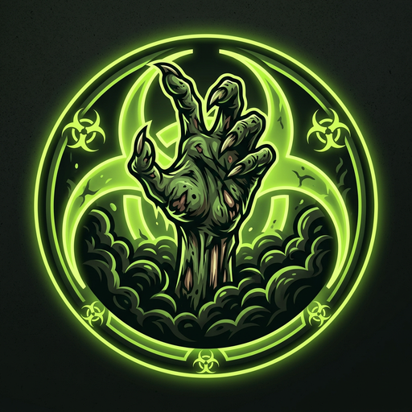

<p align="center">
  
</p>

<h1 align="center">ZombieTide — Đại Dịch Zombie</h1>

<p align="center">
  <b>Minecraft 1.21.1 · NeoForge 21.1.x · Java 21</b><br/>
  Hệ thống đợt tấn công leo thang, AI zombie được tái thiết hoàn toàn, HUD chiến thuật siêu nhỏ,
  cấu hình 100% trong game và bằng lệnh, tối ưu hiệu năng cho server.<br/>
  <i>An escalating 50-wave zombie apocalypse with rebuilt horde AI, a tiny tactical HUD,
  fully in-game configuration, and server-friendly performance.</i>
</p>

---

## ✨ Tính năng (Features)

| Đặc tả (the brief) | Thực hiện trong ZombieTide | Chỉnh ở đâu |
|---|---|---|
| Tái tạo AI zombie, thuật toán tối ưu | Goal săn ngưởi chơi **không cần nhìn thấy** (mũi + tai), quét có nhịp, tăng tốc bằng staggered-tick | `zombies.*` |
| Zombie nhạy bén, điên cuồng, **nghe thấy ngưởi chơi** | "Bộ tai" thu tiếng: chạy nước rút, đào khối, ăn uống, mở cửa/rương, bắn tên, nổ TNT… mỗi hành động một độ ồn riêng | `zombies.hearingRadius`, `zombies.noiseCooldownTicks` |
| Ngày thưởng zombie nhạy hơn, **trong đợt điên cuồng**, **sau mỗi đợt thông minh hơn** | Doctrine 2 trạng thái (bình thưởng / cuồng loạn); tầm phát hiện, thính giác, tốc độ, gọi bạn, kháng knockback tăng theo số đợt | `zombies.followRangePerWave`, `hearingPerWave`, `speedPerWave`, `reinforcementFromWave` |
| Đợt đầu **8 phút**, mỗi đợt **+2 phút**, mặc định **50 đợt** | Máy trạng thái đợt chính xác: nghỉ → báo động → vây hãm | `waves.maxWaves=50`, `firstWaveMinutes=8`, `waveIncrementMinutes=2` |
| Trong đợt zombie **không cháy nắng**, đi lại bình thưởng | Tắt lửa từ nắng mỗi tick + gỡ goal trốn nắng trong lúc đợt | `zombies.noBurningDuringWaves` |
| **Sinh cả ban ngày** khi đang trong đợt, dùng cơ chế sinh tự nhiên | Engine sinh dùng đúng placement predicate của vanilla (`SpawnPlacementTypes.ON_GROUND`) + cho phép placement bỏ qua ánh sáng | `spawning.daylightSpawn`, `boostNaturalPlacement` |
| **Báo động ~5 giây** trước khi vào đợt (kèm âm thanh dài tròn 5s) | Còi báo động custom `zombietide:wave_alarm.ogg` dài đúng 5.0s + title + chat | `waves.alarmSeconds=5`, `waves.alarmSound` |
| Trong đợt **chỉ zombie thưởng** được sinh; quái khác & biến thể tỉ lệ **cực thấp**; zombie con/nước/lây nhiễm cũng cực hiếm | Bộ lọc `FinalizeSpawnEvent`: biến thể → đổi thành zombie thường, quái khác → hủy 98% | `variantKeepChance=0.02`, `babyKeepChance=0.02`, `nonZombieKeepChance=0.02` |
| Zombie gây **tối đa 2 tim** sát thương | Hard-cap ở `LivingIncomingDamageEvent` (mọi biến thể zombie đều bị kẹp) | `zombies.maxDamageHearts=2.0` |
| Tốc độ nhanh nhất chỉ hơn ngưởi chơi **0.2 lần** | Trần speed attribute = `0.12` (ngưởi chơi `0.10`) — không gđoạn nào vượt được | `zombies.maxSpeed=0.12` |
| **Không mặc giáp, chỉ cầm khối** | Tước giáp mỗi spawn (sau khi vanilla trang bị hệ), vũ khí bị tước, 35% cầm khối ngẫu nhiên, không nhặt đồ | `zombies.stripArmor`, `allowOnlyBlockItems`, `heldBlockChance`, `heldBlocks` |
| **Từ đợt 20** một số zombie có thể **phá khối** | `BlockBreakGoal`: nhai khối chặn đường bằng cơ chế vanilla (vết nứt + tiếng), tôn trọng `mobGriefing` | `blockBreakFromWave=20`, `blockBreakChance=0.35`, `blockBreakMaxHardness`, `blockBreakBlacklist` |
| Bị vài con đánh trúng → **hiệu ứng xấu ngẫu nhiên** | Pool hiệu ứng có trọng số, mở khóa độc hơn theo đợt (wither từ đợt 30, darkness từ đợt 40) | `effects.list`, `effects.procChance=0.35` |
| Sát thương nhiều → **máu bắn lên màn hình, mờ đỏ** | "Trauma" tích lũy theo máu mất → **3 họa tiết máu bắn** ngẫu nhiên + lớp **blur đỏ xếp chồng** (nhiều pass mờ), nhịp theo tim, máu nhạt dần | `damageOverlay.intensity`, `maxAlpha`, `blurPasses`, `fadePerTick`, `splatterVariants` |
| **Bám theo cả ngưởi chơi chế độ Sáng tạo** | Goal săn tự viết lại (không qua bộ lọc creative của vanilla) + cảm biến + engine sinh đều tôn trọng công tắc; spectator là tùy chọn riêng | `targeting.targetCreativePlayers`, `targeting.targetSpectators`, `spawning.pressureCreativePlayers` |
| **Máu zombie tối đa = ngưởi chơi + 5 tim** | Trần `MAX_HEALTH` = maxHealth ngưởi chơi gần nhất + `healthMaxHeartsAbovePlayer` (mặc định 5 tim → trâu nhất 15 tim); tăng dần theo đợt nhưng không bao giờ qua trần | `zombies.healthBaseHearts`, `healthPerWaveHearts`, `healthMaxHeartsAbovePlayer` |
| **Chỉnh khoảng cách/độ dài TỪNG ĐỢT** | Override theo đợt: `"đợt=giây"` trong config + lệnh `/zombietide interval <đợt> [giây|clear]`, `/zombietide duration …` — áp dụng ngay vào đếm ngược đang chạy | `waves.intervalOverrides`, `durationOverrides`, `calmMinutesPerWave` |
| **HUD cực nhỏ** giữa cạnh trên: thanh tiến trình + đếm **ngày/giờ/phút/giây** | Lớp HUD scale 0.7 mặc định, thởi nhịp tim, màu trạng thái | `hud.*` |
| Trong đợt HUD **đếm ngược hết đợt** từng giây, hết đợt quay lại đếm ngày | Thanh tiến trình: bình thường "đầy dần", chiến tranh "rỗng dần" | `hud.timeFormat` |
| **Logo riêng, làm như mod chuyên nghiệp** | Emblem độc quyền 1024² (tay zombie + vòng biohazard), mods.toml đầy đủ | `logo.png` |
| **Config chỉnh mọi thứ trong game** (ấn Mod → Config) | ~75 khóa trong COMMON + CLIENT, mở qua màn hình cấu hình bản địa của NeoForge, có dịch EN/VI | `zombietide-*.toml` |
| **Lệnh chỉnh mọi thứ + gọi/reset đợt** | `/zombietide` | xem dưới |

---

## 🧠 Hệ AI được tái thiết như thế nào

1. **ZTHuntPlayerGoal** — `NearestAttackableTargetGoal` với `mustSee=false`: zombie khóa mục tiêu xuyên tường trong tầm `followRange` (tăng dần theo đợt). Không xóa goal vanilla — chồng thêm nên tương thích mod khác.
2. **SenseEngine** — bản đồ "độ ồn" (loudness) nhân với bán kính nghe: chạy 0.75×, đi bộ 0.45×, bới 0.15×, đào khối 1.0×, đánh nhau 0.7×, nổ 3.0×… Zombie chưa có mục tiêu sẽ hóng theo tiếng động; mỗi con có cooldown riêng (attachment, không lưu đĩa) nên không bị spam.
3. **Frenzy theo pha** — trong đợt: tầm phát hiện +16, kháng knockback tăng, gọi bạn từ đợt 6, **không trốn nắng, không cháy**; hết đợt trả lại hành vi tránh nắng của lũ zombie thường — giữ vibe vanilla ở ngày bình thường.
4. **BlockBreakGoal (đợt 20+)** — khi navigation "bó tay", zombie soi khối giữa nó và con mồi (kể cả khối ngang tầm mắt/cửa), gặm có tiếng + crack-progress, xong hồi chiêu; tôn trọng độ cứng & blacklist, `mobGriefing=false` thì thôi.

## 🌊 Vòng đợt chuẩn xác

```
bình yên (waves.calmMinutes, mặc định 10 phút)
   └─[5s còi báo động]→ ĐỢT N (8 + 2×(N-1) phút) → bình yên → …
```

- Đợt 1 = **8 phút**, đợt 50 = **106 phút**. Sau đợt 50: `waves.afterLastWave = CONTINUE | LOOP | STOP`.
- Khoảng nghỉ & độ dài **từng đợt có thể chỉnh riêng** (override `"đợt=giây"` hoặc lệnh `interval`/`duration`); công thức nghỉ hỗ trợ tăng/giảm theo đợt (`calmMinutesPerWave`).
- Trạng thái lưu trong `SavedData` của overworld → tắt server không mất tiến trình.
- NGOẠI LỆ: không có zombie nào nếu difficulty = Peaceful và vẫn tôn trọng `doMobSpawning` (tắt được).

## ⌨️ Lệnh (Commands)

| Lệnh | Quyền | Tác dụng |
|---|---|---|
| `/zombietide status` | mọi ngưởi | Trạng thái: đợt hiện tại, thởi gian còn lại, số zombie |
| `/zombietide start [instant]` | OP | Gài còi gọi đợt kế (`instant` = bỏ báo động) — alias `/zombietide summon` |
| `/zombietide end` | OP | Kết thúc đợt đang chạy |
| `/zombietide wave <n> [instant]` | OP | Nhảy thẳng tới đợt n |
| `/zombietide interval [n] [giây\|clear]` | xem: mọi ngưởi; sửa: OP | **Khoảng nghỉ trước từng đợt**: xem hiệu lực / đặt / xóa override |
| `/zombietide duration [n] [giây\|clear]` | xem: mọi ngưởi; sửa: OP | **Độ dài từng đợt**: xem hiệu lực / đặt / xóa override |
| `/zombietide reset` | OP | **Reset về ngày đầu** (đợt 1, đếm lại từ đầu) |
| `/zombietide pause` / `resume` | OP | Đóng băng / chạy tiếp chu kỳ |
| `/zombietide config list [lọc]` | mọi ngưởi | Liệt kê ~75 khóa config |
| `/zombietide config get <key>` | mọi ngưởi | Đọc giá trị |
| `/zombietide config set <key> <giá_trị>` | OP | Đổi + **lưu thẳng vào file config**, hiệu lực ngay |

Alias rút gọn: `/zt …`.

## ⚙️ Cấu hình trong game

`Esc → Mods → ZombieTide → Config` — màn hình cấu hình bản địa của NeoForge, đầy đủ nhãn song ngữ:

- `zombietide-common.toml` — toàn bộ gameplay (đợt, zombie, sinh, hiệu ứng) — chỉnh được cả ở singleplayer và trong server (qua lệnh).
- `zombietide-client.toml` — HUD & màn đỏ (máy nào chỉnh máy đó).

Mọi con số "chuẩn đặc tả" là **mặc định được ghim sẵn**, bạn vẫn có thể vặn tùy thích — mod sẽ kẹp lại theo trần an toàn.

## 🔊 Âm thanh báo động custom

`zombietide:wave_alarm` — còi không quân 5.0 giây được tổng hợp riêng cho mod (3 nhịp lên-xuống), phát đúng lúc T-5s trước mỗi đợt tới từng ngưởi chơi. Đổi sang âm khác bằng `waves.alarmSound`.

## ⚡ Hiệu năng dành cho server thật

- Quét spawn/máy trạng thái theo chu kỳ có **stagger** (mỗi ngưởi chơi lệch pha) — không spike mỗi tick.
- Sinh tối đa 1 zombie/ngưởi/chu kỳ, trần sống rõ ràng (`capPerPlayer + x×wave ≤ capMax`).
- Tai zombie: sampling 2.5 Hz + sự kiện rởi rạc, cooldown từng con.
- Đồng bộ HUD (tiny) mỗi giây, đúng 1 packet.

## 📦 Cài đặt

1. Minecraft **1.21.1** + NeoForge **21.1.x** (khuyến nghị ≥ 21.1.100).
2. Thả `zombietide-<phiên bản>.jar` vào thư mục `mods/`.
3. Vào game — đợt 1 sẽ đến sau `calmMinutes` đầu tiên. Chúc sống sót.

## 🛠 Build từ mã nguồn

```bash
./gradlew build      # → build/libs/zombietide-1.1.0.jar
./gradlew runClient  # chạy thử client
./gradlew runServer  # chạy thử server headless
```

CI (GitHub Actions) tự build & phát hành JAR tại mục **Releases** của repo.
Workflow đóng gói sẵn tại `ci/build.yml.template`. Khi nào token GitHub được cấp quyền
`workflows` (kết nối lại GitHub trong Arena), chỉ cần đổi tên/di chuyển file về
`.github/workflows/build.yml` là pipeline tự chạy: build JAR, upload artifact và đính kèm
JAR vào release theo tag.

---

## 🇬🇧 English summary

**ZombieTide** turns survival into an escalating siege: 50 waves (first = 8 minutes, each +2 minutes), 5-second air-raid sirene before every assault, zombies that hunt by sound and smell (no line-of-sight needed), siege spawning that works at high noon, sunburn immunity mid-wave, 2-heart damage cap, 1.2× player speed cap, armorless block-carrying ghouls, block-breaking from wave 20, weighted harmful-effect bites, blood splattering across your screen under a layered red blur, zombies that stalk even creative-mode players, zombie health hard-capped at player + 5 hearts, per-wave calm-gap & duration overrides (config + `/zombietide interval|duration`), and a tiny top-center HUD counting days/hours/minutes/seconds. Everything — every radius, cap, chance, list, per-wave timing — is tunable live, via `/zombietide config` or the NeoForge config screen.

<p align="center"><i>“Bạn không trốn được thứ nghe thấy bạn.”</i></p>
